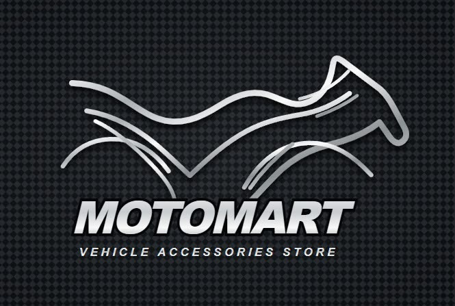

# MotoMart — Premium Bike Accessories & Riding Gear (2026 Edition)



An advanced, full-stack e-commerce web application for motorcycle accessories, riding gear, and tech packs. Built with **Node.js, Express, MongoDB Atlas, Mongoose, and vanilla HTML5/CSS3/JavaScript**.

---

## 🚀 Quick Start (Running Locally)

1. Open PowerShell in `D:\project`:
   ```powershell
   npm install
   npm start
   ```
2. Open **`http://localhost:5000`** in any web browser.

---

## 🌐 Running on Other Devices / Public Access

- **Same Wi-Fi / Local Network**: Open `http://192.168.1.4:5000` on any device connected to the same Wi-Fi.
- **Instant Public Tunnel**: Run `npx localtunnel --port 5000` to get an instant worldwide HTTPS link.
- **24/7 Free Cloud Hosting**: Deploy directly to [Render.com](https://render.com) using the GitHub repo and the `.env` database connection.

---

## ⚡ Key Features

### 1. 🍃 MongoDB Atlas Cloud Database Integration
- **Full Database Sync**: Connected directly to your live MongoDB Atlas cluster.
- **User Account Registration**:
  - Name, Email, Phone, and Password.
  - **Confirm Password** validation with real-time matching indicator.
  - **Bcrypt Password Encryption**: Industry-standard secure password hashing.
  - **Sign In / Login**: Fast authentication with persistent session storage.
  - **Automatic Email Capture**: Registrations automatically triggered via Account Modal, Newsletter signups, and Checkout delivery entries.
  - **Order History Attachment**: Orders placed are automatically linked to the user's MongoDB profile.

### 2. 📱 Instant UPI / QR Code & Payment Gateway
- **Authentic UPI QR Code**: Dark-themed QR code frame with Google Pay emblem and animated laser scanner overlay.
- **Dynamic Payable Amount**: QR code amount automatically syncs with the live cart total.
- **UPI Tabs**: Quick toggle between **📷 Scan QR Code** and **✍️ Enter UPI ID** with `@okhdfcbank`, `@okaxis`, `@paytm`, and `@ybl` chips.
- **Credit / Debit Card Interface**:
  - Real-time card formatting (`4532 8900 1234 5678`).
  - Automatic card brand badge detection (`Visa`, `Mastercard`, `RuPay`, `Amex`).
  - Formatted Expiry Date (`MM / YY`) and masked CVV (`•••`).
- **Cash on Delivery (COD)**: Doorstep verification option.

### 3. 🛍️ Slide-Over Cart Drawer & Pricing Engine
- **Free Shipping Progress Tracker**: Dynamic progress bar calculating threshold against ₹2,999.
- **Promo Code Discounts**:
  - `MOTOMART10`: **10% OFF** entire cart.
  - `WELCOME500`: **₹500 flat discount**.
  - `FREESHIP`: **Free express shipping**.
- **Persistent State**: Full `localStorage` persistence across sessions.

### 4. 🏍️ 18 Curated Rider Products in Catalog
1. **Trailblazer Carbon Helmet** (₹2,499) — ECE 22.06 & DOT Certified
2. **Shift Pro Carbon Gloves** (₹899) — CE Level 2 Goat Leather
3. **Lumix Pro Auxiliary Pods** (₹1,299) — 8000 Lumens IP68 Waterproof
4. **Vanguard Utility Roll Pack** (₹1,799) — 35L Welded TPU Waterproof
5. **Roadside Precision Tool Kit** (₹1,499) — 28-Piece Cr-V Steel
6. **Aero Polarized Riding Sunglasses** (₹1,299) — TR90 Memory Frame
7. **Thermal Wind-Shield Neck Gaiter** (₹399) — Polar Microfleece
8. **Bionic D3O Knee & Shin Guards** (₹999) — CE Level 2 Non-Newtonian Armor
9. **All-Terrain Armored Touring Jacket** (₹4,999) — 600D Cordura All-Weather
10. **Interceptor Adventure Riding Boots** (₹2,999) — CE Certified Enduro Lug Sole
11. **ShineXPro 1500 GSM Microfiber Towel** (₹645) — Scratchless Twisted-Loop
12. **SHEEBA All-in-One Liquid Polish** (₹136) — Hydrophobic Fairing Polish
13. **Boldfit UV-Shield Riding Balaclava Mask** (₹329) — UPF 50+ Ice Silk
14. **Portronics Mobike 4 Bike Phone Mount** (₹296) — 360° Anti-Shake Quad Lock
15. **Anti-Slip Gear Shift Shoe Protector** (₹199) — Wear-Resistant TPU
16. **Yobbo 360° Motorcycle Bottle & Cup Cage** (₹348) — CNC Aluminum Swivel
17. **OTO2EYE 360° HD Blind Spot Convex Mirrors** (₹139) — Real Glass Pack of 2
18. **UN1QUE PT400 150PSI Digital Air Compressor** (₹1,599) — 12V 120W Auto-Off

### 5. 🔍 Filter, Search & Sizing Tools
- **Instant Search & Sort Toolbar**: Search by keyword, filter by categories, price slider, and sort by rating/price.
- **Quick View Product Modal**: Specs table, interactive size selector, and **PIN code delivery checker**.
- **Master Sizing Guide Modal**: Comprehensive measurement charts for helmets and gloves.
- **Wishlist / Saved Gear**: Slide-over wishlist tray with live badge.
- **🌙 Light & Dark Theme**: Instant toggle with theme persistence.

---

## 📁 Project Structure

```
D:\project\
├── .env                  # MongoDB Atlas Cluster credentials & Port configuration
├── server.js             # Express & Mongoose backend API (Auth, Orders, Stats)
├── package.json          # Node dependencies (express, mongoose, bcryptjs, cors, dotenv)
├── index.html            # Semantic HTML5 layout, modals, drawers, and checkout panes
├── styles.css            # Custom properties, dark theme, animations, and responsive styles
├── script.js             # Frontend application logic, catalog, cart, and MongoDB client
├── logo.png              # Carbon-metallic MotoMart brand logo
├── images/               # Product and payment assets
│   ├── upi-logo.jpg      # Multi-app UPI payment emblem
│   ├── sample-upi-qr.jpg # Sample dense QR code with Google Pay logo
│   └── ... (product image assets)
```
